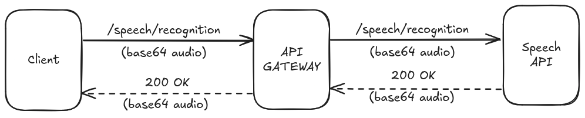

# Language Speech Teacher Backend Project
Python 3 project Restful API to help speek a new language, using AI modules to help speech improvement



### Version
1.0.0

## Table of Contents

- [Technologies Used](#technologies-used)
- [Documentation](#documentation)
- [Getting Started](#getting-started)
  - [Prerequisites](#prerequisites)
  - [Installation](#installation)
  - [Usage](#usage)
- [Contributors](#contributors)

## Introduction

Python 3 based language speaking teacher to assist users in training and improving new language skills. 

## Technologies Used

- [Python 3](https://docs.python.org/3/)
- [FastAPI](https://fastapi.tiangolo.com/)
- [uvicorn](https://www.uvicorn.org/)
- [SpeechRecognition](https://pypi.org/project/SpeechRecognition/)
- [language_tool_python](https://pypi.org/project/language-tool-python/)

## Documentation

The documentation for this project can be found [here](https://github.com/bemebox/language-speech-teacher-backend/documentation).

[Speech API](http://localhost:8000/docs)

## Getting Started

These instructions will guide you to copy the project from the repository and run it.

### Prerequisites

Make sure you have the following installed:

- Python 3.x: [Download Python](https://www.python.org/downloads/)

### Installation

1. Clone the repository:
    ```bash
    git clone git@github.com:bemebox/language-speech-teacher-backend.git
    cd language-speech-teacher-backend
    ```
2. Create a new virtual environment:
    ```bash
    python -m venv speechenv
    source speechenv/bin/activate
    ```
3. Install dependencies:
    ```bash
    pip install fastapi
    pip install "uvicorn[standard]"
    pip install SpeechRecognition
    pip install language_tool_python
    ```
4. Start the FastAPI application:
    ```bash
    uvicorn main:app --reload
    ```

### Usage

To run the API, use the following command:
```bash
    uvicorn main:app --reload
```

## Contributors

* **BEOM &copy; 2024**